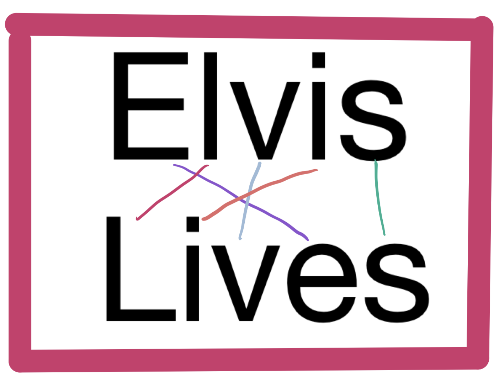

# Benchmarking (aka "I don't have time for this")

Imagine that you've been working on this program on a team of developers. You've
done all the right things up until now, including writing [unittests](tests/test_anagrams.py).

Unfortunately, a previous teammate not only committed code that made the benchmarking tests fail, but they force-pushed to *master* after rewriting the git history, so you can't simply go back in the history to fix things. Especially since, in the process of ruining the timings, the developer _did_ manage to implement features that weren't there before.

Your task is to modify [anagrams.py](anagrams.py) such that the tests pass again. If the problem isn't obvious to you by visually examining the `anagrams.py` module, consider using the profiling techniques that you learned about in the lessons to pin down the problem. Using a debugger may also help you to get a handle on exactly _why_ things are slow.

## A Skipped unit test?
If you look inside `test_anagrams.py`, you'll notice that the `test_long` unit test is currently being skipped. That's because if it were to run with the current implementation of `find_anagrams` it would take several minutes to complete. We suggest that you try and get the `test_short` to pass first, then comment out the `@unittest.skip` line and ensure that the tests still pass.


## Testing with Unittest
This assignment has separate unit tests to help you during development. The unit tests are located in the `tests` folder; you should not modify these.  Make sure all unit tests are passing before you submit your solution. You can invoke the unit tests from the command line at the root of your project folder:
```console
$ python -m unittest discover tests
```
You can also run and debug these same tests using the `Test Explorer` extension built in to the VSCode editor, by enabling automatic test discovery.  This is a really useful tool and we highly recommend to learn it.

https://code.visualstudio.com/docs/python/testing#_test-discovery

- Test framework is `unittest`
- Test folder pattern is `tests`
- Test name pattern is `test*`

## Submitting your work
To submit your solution for grading, you will need to create a github [Pull Request (PR)](https://docs.github.com/en/github/collaborating-with-issues-and-pull-requests/about-pull-requests).  Refer to the `PR Workflow` article in your course content for details.